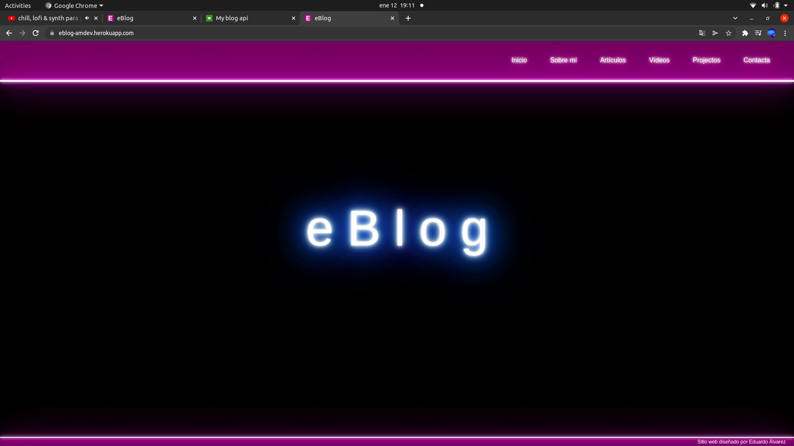
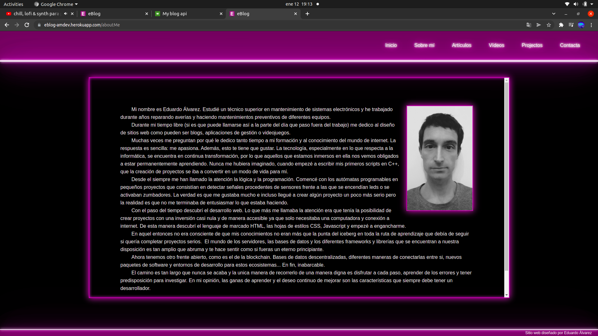
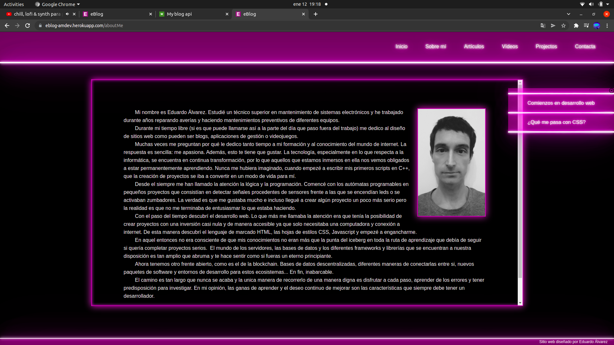
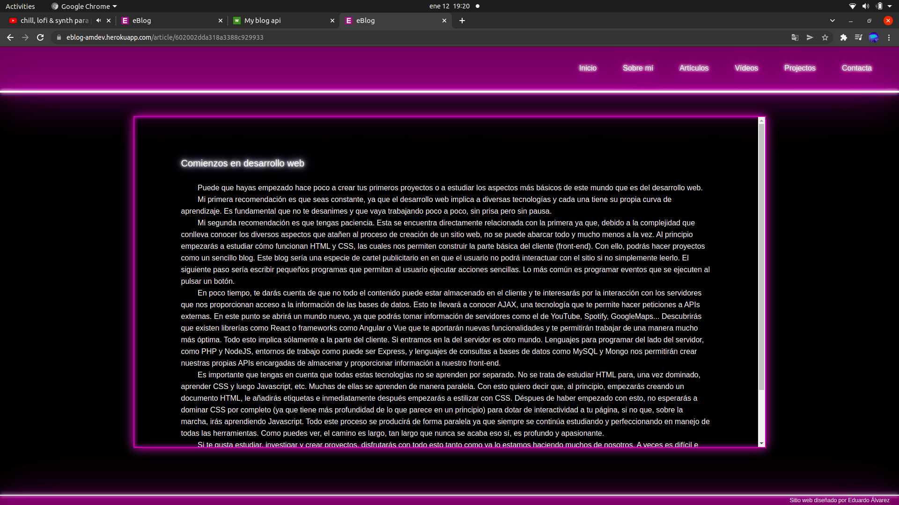
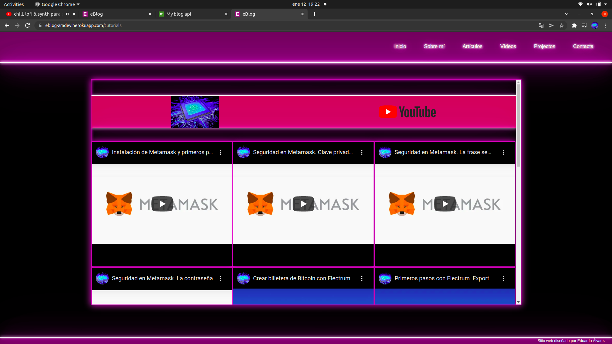
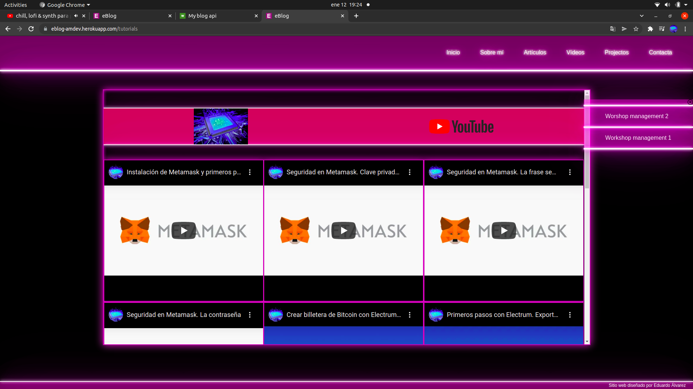
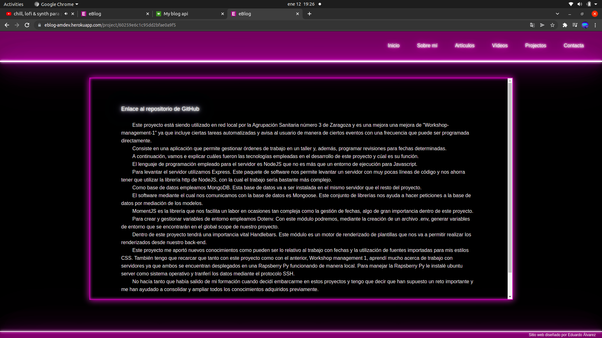
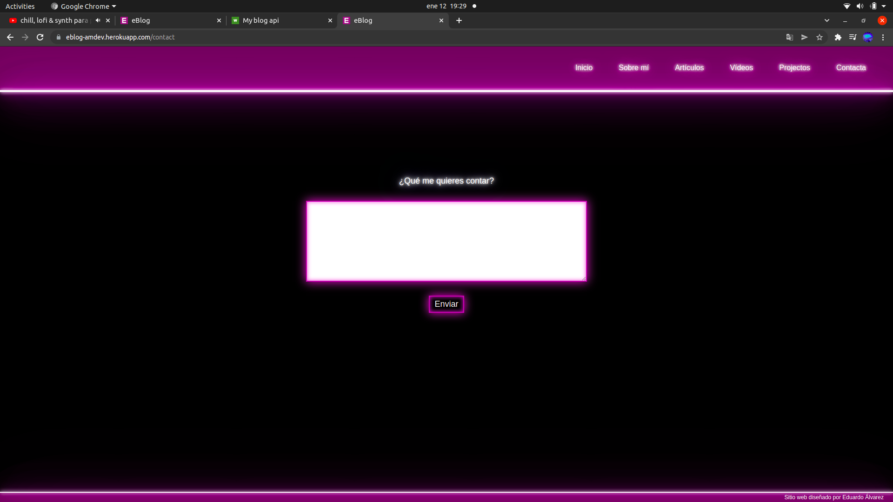

# Blog personal

Si quieres utilizar la aplicación puedes acceder en esta url: https://eblog-amdev.herokuapp.com/

## Descripción del proyecto

Se trata de mi propio blog personal realizado con react y que dispone de una API REST que le suministra la información procedente de una base de datos MongoDB

## ¿Qué contiene la aplicación?

Iremos moviéndonos por la aplicación a través de la barra de navegación para encontrar los siguientes apartados.

### Sobre mí

Contiene algo de información personal y una breve reseña acerca de como llegué al mundo del desarrollo web.

### Artículos

Si hacemos click el artículos se desplegará una barra de navegación lateral en la que se nos mostrarán los artículos subidos a la base de datos. En este caso serían los dos artículos que aparecen en la imágen.

Para leer un artículo haremos click sobre el enlace correspondiente y se nos mostrará en pantalla.

### Vídeos

Si desde nuestra barra de navegación entramos en el apartado vídeos veremos una lista de con material audiovisual subido a la plataforma YouTube. Contiene tutoriales acerca de tecnología blockchain.

### Proyectos

Al hacer click en proyectos se nos desplegará una barra de navegación lateral que contendrá un listado de proyectos.

Si seleccionamos uno de ellos veremos una descripción del mismo así como un enlace al repositorio de GitHub en el que se encuentra su código.

### Contacto

Si entramos en contacto se nos mostrará un textarea con un botón de enviar. Con ello Se puede enviar cualquier mensaje que se escriba directamente a mi dirección de correo.

## Tecnologías utilizadas

### `React`

React es una biblioteca de Javascript que sirve para crear interfaces de usuario de una manera sencilla y basándonos en la elaboración de componentes.

### `ReactDOM`

React Dom es el conjunto de bibliotecas de React que nos permiten emplear funcionalidades implementadas específicamente para aplicaciones web.

### `React Router DOM`

Se trata de un conjunto de funcionalidades que nos permiten linkear y enrutar todo nuestro proyecto.
En este proyecto he empleado la versión 6 de este paquete de software.

### `React Scripts`

Nos permite arrancar scripts de manera directa.

### `React YouTube`

React YouTube nos permmite incorporar un componente que recibe el id de un vídeo por props para hacer automáticamente una consulta y renderizar el contenido que le llega como respuesta.

### `EmailJS`

Este paquete de software nos habilita la posibilidad de enviar correos directamente desde la aplicación a una dirección concreta.

## Puesta en marcha

Para arrancar este proyecto de manera local los pasos a seguir son los siguientes:

### `Descargar el repositorio`

Clonaremos el repositorio en nuestro equipo utilizando el comando "git clone" seguido de la url del repositorio.

### `Instalar los paquetes de software`

Una vez clonado el proyecto, accederemos a la raíz del mismo mediante nuestra terminal de comandos para, una vez dentro, ejecutar el comando "npm i".

### `Arrancar el proyecto`

Para arrancar el proyecto debemos ejecutar el comando "npm start".

## Descripción de la api:

Se trata de una api que proporciona al fron .nd de mi sitio web toda la información que necesita tomándola de una base de datos MongoDB que se encuentra en Atlas.

Una parte muy importante a destacar dentro de este proyecto de back-end es que contiene una interfaz gráfica desarrollada con Handlebars que permite al administrador modificar la información de la base de datos de una manera sencilla y rápida.
Esta aplicación se encuentra desplegada en https://eblog-api.herokuapp.com/ pero solo puede ser accedida por el administrador ya que requiere de usuario y contraseña para ser utilizada.

La aplicación a la que da servicio se encuentra en la siguiente url: https://eblog-amdev.herokuapp.com/

## Cómo utilizar la interfaz gráfica de la api

Una vez estemos logueados tendremos acceso a la pantalla de bienvenida.

Como podemos ver, también tenemos acceso a la barra de navegación y, con ello, a las siguientes funcionalidades.

### Info

Nos permite trabajar con la información del "sobre mí" (en inicio), correo de contacto, el título de la página principal y el pie de página.

#### Inicio

Contiene la información del "sobre mí". Si entramos nos mostrará el texto actual y las opciones de modificar y volver.

Si entramos en modificar nos aparecerá un textárea que nos permitirá modificar el contenido.

#### Email

En el apartado de email nos mostrará la información del correo con las opciones de modificar y volver.
No voy a mostrar imágenes de las mismas ya que contienen las claves para trabajar con emailJS.

#### Título

El título de la página principal de la aplicación lo podemos ver en este apartado.

Si entramos en modificar podremos modificar el contenido.

#### Pie de página

Nos muestra el contenido de nuestro pie de página.

En actualizar podemos cambiar el contenido del mismo.

### Artículos

Este apartado nos mostrará un listado con los artículos almacenados en la base de datos. Aquí tenemos la opción de ver un artículo haciendo click sobre él o bien crear un nuevo artículo para añadir al listado.

### Ver artículo

Dentro del detalle del artículo podemos ver el contenido del mismo y acceder a las oopciones de volver a la pantalla anterior, actualizar y eliminar.

Si entramos en actualizar podremos cambiar el título y el contenido del artículo propiamente dicho.

Si pulsamos en eliminar borraremos directamente el artículo de nuestra base de datos.

### Nuevo artículo

Si, estando en artículos, pulsamos en nuevo artículo accedermos a un formulario en el que podremos rellenar el título y el contenido del nuevo artículo que queramos publicar.

### Vídeos

Si accedemos a vídeos veremos una lista completa con los títulos de los vídeos de YouTube a los que accederemos desde nuestro front-end. También tenemos la opción de acceder a la información de un vídeo en concreto o de introducir la de uno nuevo.

#### Ver vídeo

En esta pantalla se nos mostraran tanto el título del vídeo como las opciones de actualizar, volver o borrar de nuestra base de datos.

Si pulsamos en actualizar veremos la información del vídeo es decir, el título y el id, y la podremos modificar.

Si pulsamos en borrar borraremos la información del vídeo de nuestra base de datos.

#### Nuevo vídeo

Si accedemos a nuevo tutorial podremos ver un formulario que nos servirá para introducir la información de un nuevo vídeo.

### Proyectos

Si accedemos a proyectos veremos una lista completa con los nombres de los proyectos que se encuentran en nuestra base de datos. También tenemos la opción de acceder a la información de un proyecto o insertar la de uno nuevo.

#### Ver proyecto

Aquí accederemos a la descripción del proyecto así como a las opciones de actualizar y eliminar.

Si pulsamos en actualizar veremos la información del proyecto es decir, el título, la descripción y la url de GitHub, y la podremos modificar.

Si pulsamos en borrar borraremos la información del proyecto de nuestra base de datos.

#### Nuevo vídeo

Si accedemos a nuevo proyecto podremos ver un formulario que nos servirá para introducir la información de un nuevo proyecto.

### Log out

Si seleccionamos la opción "log out" nuestra sesión se cerrará y seremos devueltos al "log in".

## Puesta en marcha del servidor de back-end

### Clonar el repositorio:

Copiaremos el repositorio y lo clonaremos utilizando el comando "git clone" seguido del repositorio en el directorio que deseemos.

### Instalación de paquetes:

El proyecto consta de tres directorios: benefit-api, benefit-customer y benefit-owner. Debemos entrar en cada uno de ellos y ejecutar el comando "npm i" para instalar los paquetes correspondientes.

### Primeros pasos para arrancar en local conectando con Atlas y ajuste de algunos detalles:

  - #### Crear un archivo .env y declarar las variables de entorno:

    Crearemos un archivo .env en el directorio raíz de nuestro proyecto.  
    Dentro del archivo .env declararemos nuestras variables de entorno que serán las siguientes:
      - PORT=3001
      - DB_SESSION=< Aquí irá nuestro usuario >
      - DB_PASSWORD=< Aquí irá la contraseña de nuestra base de datos >
      - DB_NAME=< Nombre de la base de datos >

  - #### Cambiaremos el "missing credentials" del inicio de sesión por un mensaje en castellano:

    Nos dirigiremos al directorio node_modules de nuestro proyecto y, dentro de la carpeta passport-local entramos en el directorio lib y abrimos el archivo strategy.js.  
    Una vez allí nos dirigiremos a la línea 75 y, donde pone "missing credentials" escribiremos el mensaje que deseemos que aparezca cada vez que falte alguna de las credenciales necesarias para iniciar la sesión.

  - #### Levantar el servidor:

    Abriremos el intérprete de comandos y, desde la raíz de nuestro proyecto, ejecutaremos el comando "npm run dev".

  - #### Abrir la aplicación:

    Abriremos nuestro navegador y, en la barra de direcciones, escribiremos "localhost:3001".

## Tecnologías empleadas en el servidor de la api

### Express

Express es un paquete de software de NodeJS que nos permite levantar un servidor de manera sencilla.

### Mongoose

Mongoose nos permite interactuar con una base datos MongoDB por medio de los modelos.

### Dotenv

Dotenv nos va a permitir crear un documento con variables de entorno que serán accesibles desde cualquier documento de la API.

### Bcrypt

Este módulo sirve para convertir la contraseña en claro que nos llega del cliente en un hash que podamos guardar en nuestra base de datos.

### Passport

Passport es un conjunto de librerías que nos permiten gestionar el acceso de los usuarios.

## ¿Qué me ha aportado este proyecto?

Este fue mi primer poryecto personal al salir de mi formación aunque durante todo este tiempo ha sufrido múltiples cambios y modificaciones. Durante el desarrollo me enfrenté a multiples problemas en solitario por primera vez.

En lo que respecta a la API, ha resultado bastante completa ya que contiene todas las tecnologías de back-end necesarias como son NodeJS, Express y MongoDB y, además, incluye renderizado de plantillas con Handlebars para crear una interfaz de usuario y no tener que hacer las modificaciones directamente en la base de datos.

Este proyecto, al igual que los  dos siguientes, sirvió de consolidación de los conocimientos adquiridos previamente ya que se utilizan React en el front-end y todas las tecnologías para el desarrollo de la API REST en la parte del back-end.
