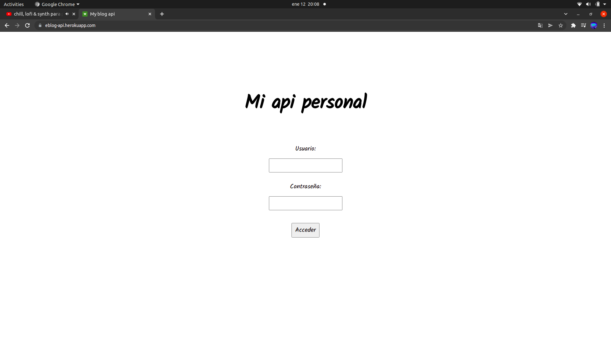
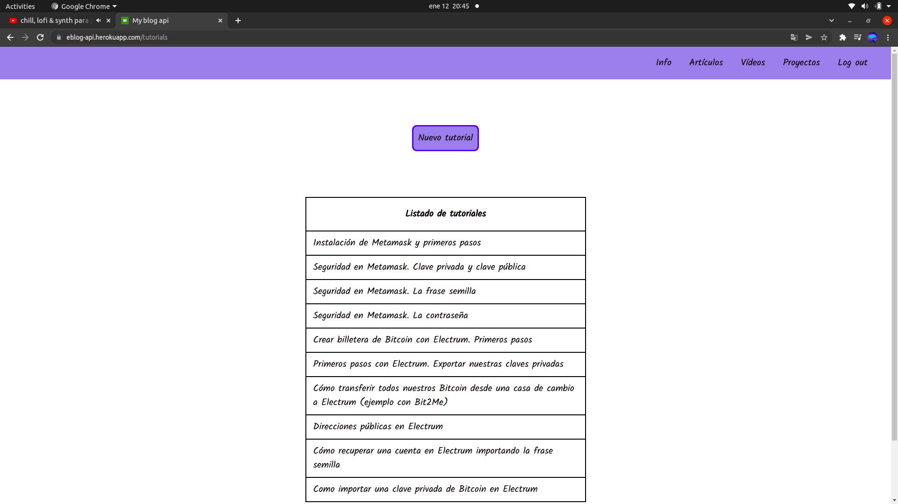
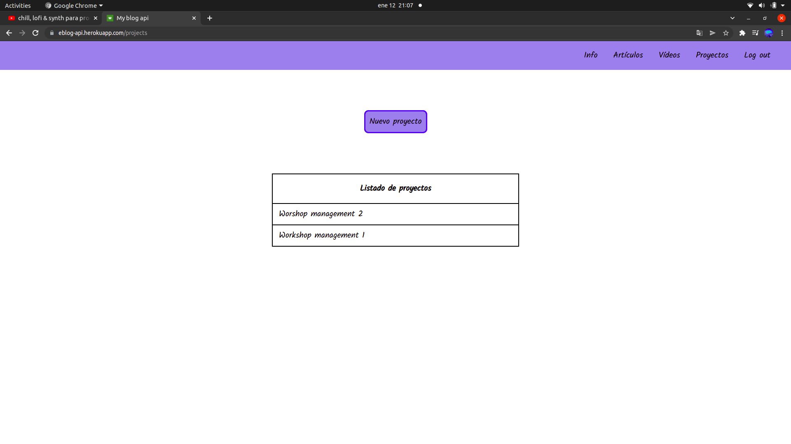
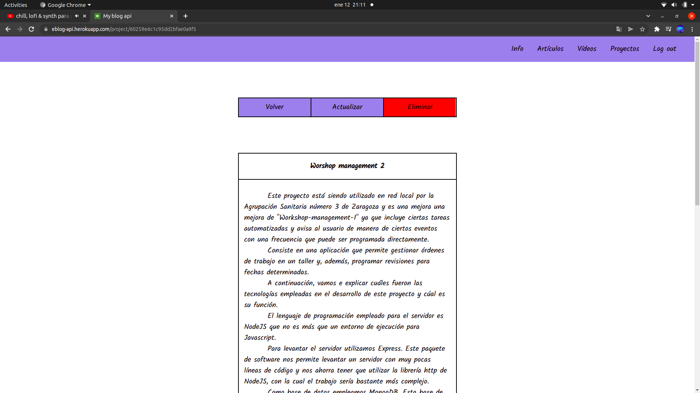

# Mi api personal

## Descripción:

Se trata de una api que proporciona al fron .nd de mi sitio web toda la información que necesita tomándola de una base de datos MongoDB que se encuentra en Atlas.
Una parte muy importante a destacar dentro de este proyecto de back-end es que contiene una interfaz gráfica desarrollada con Handlebars que permite al administrador modificar la información de la base de datos de una manera sencilla y rápida.
Esta aplicación se encuentra desplegada en https://eblog-api.herokuapp.com/ pero solo puede ser accedida por el administrador ya que requiere de usuario y contraseña para ser utilizada.

## Clonar el repositorio:

Copiaremos el repositorio y lo clonaremos utilizando el comando "git clone" seguido del repositorio en el directorio que deseemos.

## Instalación de paquetes:

El proyecto consta de tres directorios: benefit-api, benefit-customer y benefit-owner. Debemos entrar en cada uno de ellos y ejecutar el comando "npm i" para instalar los paquetes correspondientes.

## Primeros pasos para arrancar en local conectando con Atlas y ajuste de algunos detalles:

  - ### Crear un archivo .env y declarar las variables de entorno:

    Crearemos un archivo .env en el directorio raíz de nuestro proyecto.  
    Dentro del archivo .env declararemos nuestras variables de entorno que serán las siguientes:
      - PORT=3000
      - DB_SESSION=< Aquí irá nuestro usuario >
      - DB_PASSWORD=< Aquí irá la contraseña de nuestra base de datos >
      - DB_NAME=< Nombre de la base de datos >

  - ### Cambiaremos el "missing credentials" del inicio de sesión por un mensaje en castellano:

    Nos dirigiremos al directorio node_modules de nuestro proyecto y, dentro de la carpeta passport-local entramos en el directorio lib y abrimos el archivo strategy.js.  
    Una vez allí nos dirigiremos a la línea 75 y, donde pone "missing credentials" escribiremos el mensaje que deseemos que aparezca cada vez que falte alguna de las credenciales necesarias para iniciar la sesión.

  - ### Levantar el servidor:

    Abriremos el intérprete de comandos y, desde la raíz de nuestro proyecto, ejecutaremos el comando "npm run dev".

  - ### Abrir la aplicación:

    Abriremos nuestro navegador y, en la barra de direcciones, escribiremos "localhost:3000".

## Cómo utilizar la aplicación

Una vez estemos logueados tendremos acceso a las siguientes funcionalidades.

### Sobre mí

Contiene algo de información personal y una breve reseña acerca de como llegué al mundo del desarrollo web.

### Artículos

Si hacemos click el artículos se desplegará una barra de navegación lateral en la que se nos mostrarán los artículos subidos a la base de datos. En este caso serían los dos artículos que aparecen en la imágen.

Para leer un artículo haremos click sobre el enlace correspondiente y se nos mostrará en pantalla.

### Vídeos

Si desde nuestra barra de navegación entramos en el apartado vídeos veremos una lista de con material audiovisual subido a la plataforma YouTube. Contiene tutoriales acerca de tecnología blockchain.

### Proyectos

Al hacer click en proyectos se nos desplegará una barra de navegación lateral que contendrá un listado de proyectos.

Si seleccionamos uno de ellos veremos una descripción del mismo así como un enlace al repositorio de GitHub en el que se encuentra su código.

### Contacto

Si entramos en contacto se nos mostrará un textarea con un botón de enviar. Con ello Se puede enviar cualquier mensaje que se escriba directamente a mi dirección de correo.

  